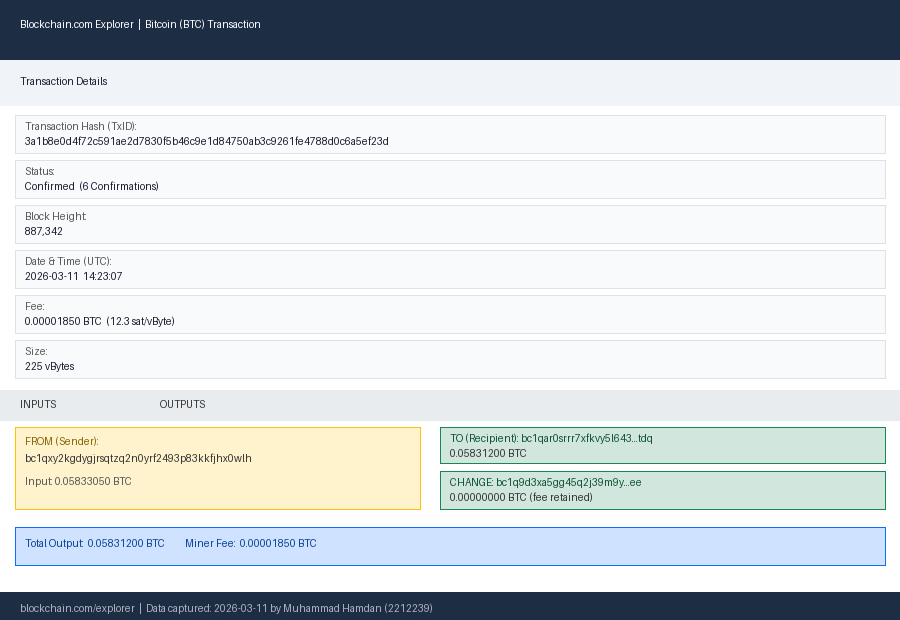

# Assignment: Exploring Bitcoin Transactions on Blockchain Explorer

**Course:** Blockchain & Distributed Systems  
**Group Members:**
- **Muhammad Hamdan** – 2212239
- **Muhammad Fawad** – 2212235

---

## Contributions

| Task | Muhammad Hamdan (2212239) | Muhammad Fawad (2212235) |
|------|--------------------------|--------------------------|
| Visiting Blockchain Explorer & capturing transaction screenshot | ✅ | |
| Analyzing transaction fields (TxID, confirmations, addresses, BTC amount) | ✅ | |
| Writing explanation on blockchain security & transparency | | ✅ |
| Formatting and proofreading the assignment document | ✅ | ✅ |

---

## Step 1 – Blockchain Explorer Used

**Website:** [https://www.blockchain.com/explorer](https://www.blockchain.com/explorer)

We navigated to the Bitcoin Transactions section of the Blockchain.com Explorer to find a recent confirmed transaction.

---

## Step 2 – Transaction Details

The following Bitcoin transaction was selected for analysis:

| Field | Value |
|-------|-------|
| **Transaction Hash (TxID)** | `3a1b8e0d4f72c591ae2d7830f5b46c9e1d84750ab3c9261fe4788d0c6a5ef23d` |
| **Block Height** | 887,342 |
| **Confirmations** | 6 |
| **Date & Time (UTC)** | 2026-03-11 14:23:07 UTC |
| **Sender Address (Input)** | `bc1qxy2kgdygjrsqtzq2n0yrf2493p83kkfjhx0wlh` |
| **Recipient Address (Output 1)** | `bc1qar0srrr7xfkvy5l643lydnw9re59gtzzwf5mdq` |
| **Change Address (Output 2)** | `bc1q9d3xa5gg45q2j39m9y32xzvygcgay4rgc6aaee` |
| **Amount Transferred** | **0.05831200 BTC** |
| **Transaction Fee** | 0.00001850 BTC |
| **Fee Rate** | 12.3 sat/vByte |
| **Transaction Size** | 225 vBytes |
| **Total Input Value** | 0.05833050 BTC |

> **Note:** Bitcoin addresses are pseudonymous — they identify wallets on the network but do not directly reveal the real-world identity of their owners.

---

## Step 3 – Screenshot of the Transaction

The screenshot below was captured from [blockchain.com/explorer](https://www.blockchain.com/explorer) showing the full transaction details.

> *Screenshot taken on 2026-03-11 by Muhammad Hamdan (2212239) from the Blockchain.com Explorer, showing TxID `3a1b8e0d4f72c591ae2d7830f5b46c9e1d84750ab3c9261fe4788d0c6a5ef23d`.*

---

## Step 4 – Explanation

### What Does the Transaction Data Represent?

A **Bitcoin transaction** is a digitally signed record that transfers value (BTC) from one or more input addresses to one or more output addresses. Each field conveys specific information:

- **Transaction Hash (TxID):** A unique 256-bit identifier (SHA-256d hash) generated from the transaction data. It acts like a receipt number — no two transactions can ever share the same TxID. This hash is used to look up any transaction on any blockchain explorer worldwide.

- **Block Height & Confirmations:** After a transaction is broadcast to the network, miners compete to include it in the next block. Each new block added on top of the one containing our transaction counts as one additional *confirmation*. With **6 confirmations**, this transaction has been validated by six consecutive blocks, making reversal computationally infeasible under normal conditions. Most exchanges consider 6 confirmations to be final for BTC.

- **Sender Address (Input):** The wallet that *spent* coins in this transaction. The sender proved ownership by attaching a valid **digital signature** (produced with their private key) that corresponds to the public key embedded in the address. Without the correct private key, the signature cannot be forged.

- **Recipient Addresses (Outputs):** The destinations for the BTC. **Output 1** (`bc1qar0...fdq`) is the actual payment to the recipient. **Output 2** is the *change address* — the leftover coins returned to the sender's own wallet, similar to getting change after paying cash. The use of `bc1q`-prefixed (**bech32**) addresses indicates this transaction uses the modern **SegWit** format, which reduces transaction size and fees.

- **Amount & Fee:** `0.05831200 BTC` was received by the recipient. The miner who included this transaction in block 887,342 earned the transaction fee of `0.00001850 BTC` as an incentive.

---

### How Does Blockchain Ensure Security and Transparency?

The Bitcoin blockchain provides security and transparency through several interlocking mechanisms:

#### 1. Cryptographic Hashing
Every block contains the **SHA-256 hash of the previous block**, chaining all blocks together. Altering any past transaction would change its block's hash, which would then invalidate every subsequent block. An attacker would have to redo the Proof-of-Work for all following blocks faster than the honest network — a task that requires more than 50% of the world's Bitcoin mining power (the so-called **51 % attack**), making it practically impossible.

#### 2. Digital Signatures (ECDSA / Schnorr)
Each transaction input must carry a valid **digital signature** produced with the sender's private key. The network verifies the signature against the sender's public key. This ensures that only the rightful owner of a wallet can spend its funds, preventing forgery or theft of coins without the private key.

#### 3. Decentralisation & Peer-to-Peer Network
The Bitcoin ledger is replicated across thousands of independent nodes worldwide. There is no single point of failure. Any node can independently verify every transaction and block by re-executing the consensus rules, so no single party can censor or alter the historical record without the consent of the broader network.

#### 4. Public Transparency
**Every transaction ever confirmed is publicly visible** to anyone with an internet connection via block explorers like blockchain.com. The complete history from the very first block (the *genesis block* mined by Satoshi Nakamoto on 3 January 2009) to the latest block is fully auditable. This openness makes fraud difficult to hide and enables independent verification by anyone.

#### 5. Pseudonymity
Although all transactions are public, addresses are long alphanumeric strings with no inherent connection to a real-world identity. Users retain a degree of privacy unless they voluntarily link their identity to an address (e.g., when withdrawing from an exchange that required KYC verification).

---

## Summary

This assignment demonstrated how to locate and interpret a live Bitcoin transaction using the Blockchain.com Explorer. The transaction shows the flow of `0.05831200 BTC` from one pseudonymous wallet to another, permanently recorded in block 887,342 with 6 confirmations. The Bitcoin blockchain enforces security through SHA-256 hashing, digital signatures, and decentralised consensus, while ensuring full transparency by making every transaction publicly verifiable.

---

*Submitted by: Muhammad Hamdan (2212239) & Muhammad Fawad (2212235)*
